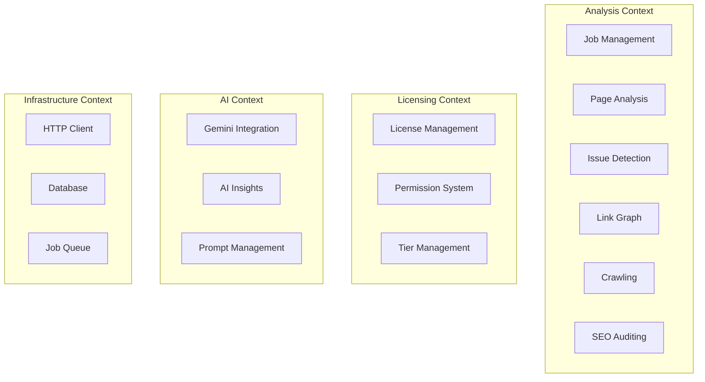
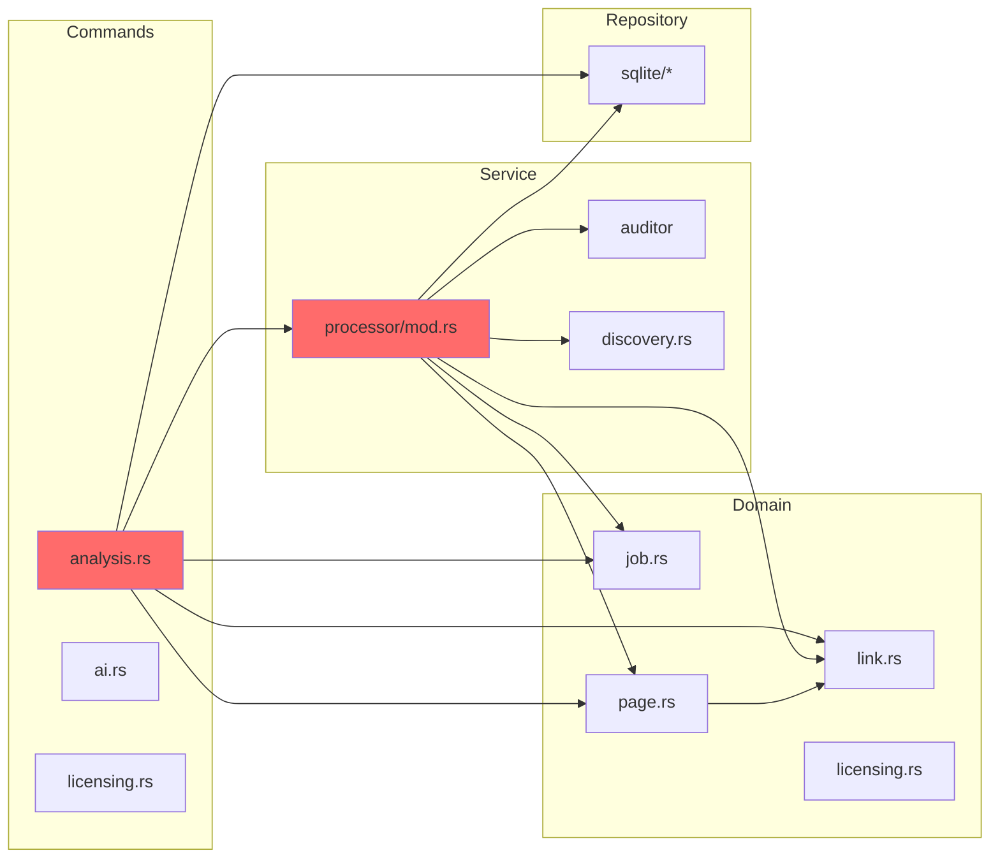
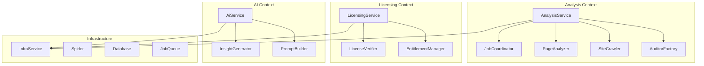
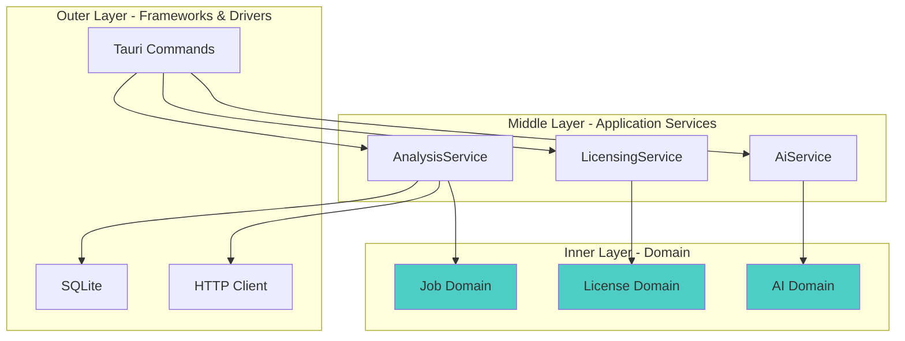
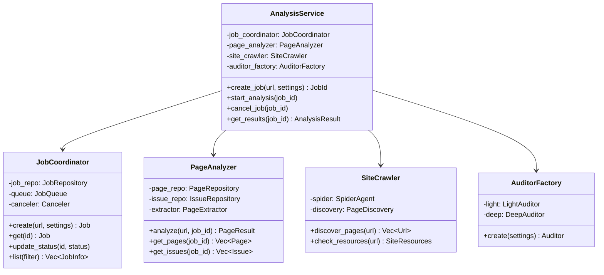
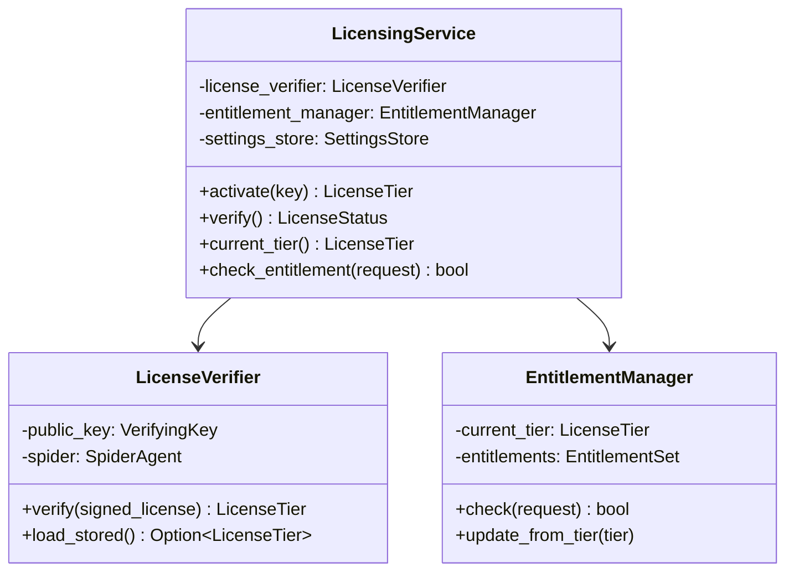
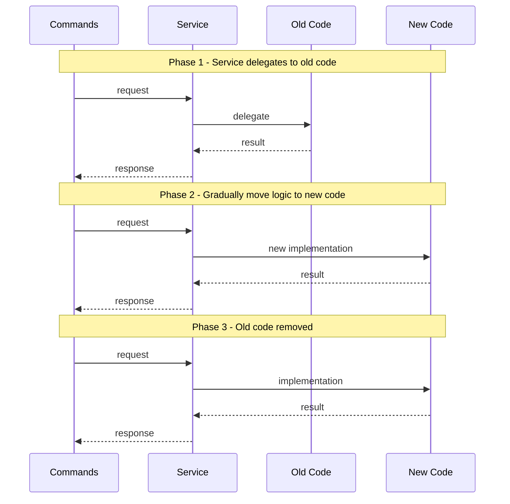

# DDD Architectural Refactoring Plan for src-tauri

## Executive Summary

This document proposes an architectural refactoring of the `src-tauri` codebase guided by Domain-Driven Design (DDD) and Evolutionary Design principles. The goal is to establish clear bounded contexts, enforce module boundaries through appropriate design patterns, and achieve high internal cohesion with low external coupling.

**Design Pattern Philosophy:** Use the right pattern for each concern - Service Layer for context boundaries, Repository for data access, Factory for object creation, Strategy for algorithmic variations. No forced uniformity.

---

## 1. Current Architecture Analysis

### 1.1 Current Module Structure

```
src-tauri/src/
├── commands/          # Tauri command handlers (API layer)
├── domain/            # Domain entities and value objects
├── extractor/         # Page extraction logic
├── lifecycle/         # Application lifecycle
├── repository/        # Data access layer
├── service/           # Business logic services
├── db.rs              # Database initialization
├── error.rs           # Error types
└── lib.rs             # Module exports
```

### 1.2 Identified Bounded Contexts

Based on analysis of the codebase, the following bounded contexts emerge:



### 1.3 Current Coupling Issues

#### Critical Issues

| Issue                    | Location                                                                      | Impact                                                                    |
| ------------------------ | ----------------------------------------------------------------------------- | ------------------------------------------------------------------------- |
| **Wildcard Re-exports**  | [`domain/mod.rs:15-28`](src-tauri/src/domain/mod.rs:15)                       | Creates a flat namespace, hiding module boundaries                        |
| **God Object AppState**  | [`lifecycle/app_state.rs:18-35`](src-tauri/src/lifecycle/app_state.rs:18)     | Holds 15+ dependencies, violates SRP                                      |
| **Leaky Domain Logic**   | [`domain/page.rs:37-78`](src-tauri/src/domain/page.rs:37)                     | `Page.audit()` creates `NewIssue` - domain knows about persistence models |
| **Cross-Module Imports** | [`service/processor/mod.rs:20-21`](src-tauri/src/service/processor/mod.rs:20) | Direct imports from multiple domains                                      |
| **Mixed Concerns**       | [`commands/analysis.rs:19-145`](src-tauri/src/commands/analysis.rs:19)        | DTOs defined in commands layer                                            |

#### Coupling Diagram - Current State



_Red indicates high coupling nodes_

---

## 2. Proposed Architecture

### 2.1 Bounded Context Structure



### 2.2 Module Structure

```
src-tauri/src/
├── contexts/                    # Bounded Contexts
│   ├── analysis/               # Analysis Context
│   │   ├── mod.rs              # Context boundary + public exports
│   │   ├── domain/             # Domain models
│   │   │   ├── job.rs
│   │   │   ├── page.rs
│   │   │   ├── issue.rs
│   │   │   └── link.rs
│   │   ├── services/           # Domain services
│   │   │   ├── mod.rs
│   │   │   ├── analysis_service.rs    # Service Layer entry point
│   │   │   ├── job_coordinator.rs     # Orchestrates job lifecycle
│   │   │   ├── page_analyzer.rs       # Page analysis logic
│   │   │   └── site_crawler.rs        # Site crawling logic
│   │   ├── factories/          # Object creation
│   │   │   └── auditor_factory.rs     # Strategy pattern for auditor selection
│   │   ├── observers/          # Event handling
│   │   │   └── progress_broadcaster.rs
│   │   └── repository.rs       # Repository trait definitions
│   │
│   ├── licensing/              # Licensing Context
│   │   ├── mod.rs
│   │   ├── domain/
│   │   │   ├── license.rs
│   │   │   ├── tier.rs
│   │   │   └── entitlement.rs
│   │   ├── services/
│   │   │   ├── mod.rs
│   │   │   ├── licensing_service.rs   # Service Layer entry point
│   │   │   ├── license_verifier.rs
│   │   │   └── entitlement_manager.rs
│   │   └── repository.rs
│   │
│   └── ai/                     # AI Context
│       ├── mod.rs
│       ├── domain/
│       │   ├── insight.rs
│       │   └── prompt.rs
│       ├── services/
│       │   ├── mod.rs
│       │   ├── ai_service.rs          # Service Layer entry point
│       │   ├── insight_generator.rs
│       │   └── prompt_builder.rs
│       └── repository.rs
│
├── infrastructure/             # Infrastructure Layer
│   ├── mod.rs
│   ├── database/
│   │   ├── mod.rs
│   │   └── sqlite/
│   ├── http/
│   │   ├── mod.rs
│   │   └── spider.rs
│   └── queue/
│       ├── mod.rs
│       └── job_queue.rs
│
├── api/                        # Application Layer
│   ├── mod.rs
│   ├── commands/               # Tauri commands
│   │   ├── analysis.rs
│   │   ├── licensing.rs
│   │   └── ai.rs
│   └── dto/                    # Data Transfer Objects
│       ├── analysis.rs
│       ├── licensing.rs
│       └── ai.rs
│
├── lifecycle/                  # Application Lifecycle
│   ├── mod.rs
│   └── app_state.rs
│
├── error.rs
└── lib.rs
```

---

## 3. Service Layer Implementation

### 3.1 Design Pattern Selection by Concern

| Concern               | Pattern           | Rationale                                          |
| --------------------- | ----------------- | -------------------------------------------------- |
| Context Boundary      | **Service Layer** | Coordinates domain operations, exposes unified API |
| Object Creation       | **Factory**       | Complex object instantiation with validation       |
| Algorithmic Variation | **Strategy**      | Auditor selection (Light vs Deep)                  |
| Data Access           | **Repository**    | Abstract persistence, enable testing               |
| Event Broadcasting    | **Observer**      | Progress reporting to multiple listeners           |
| Concurrency Control   | **Semaphore**     | Domain-based rate limiting                         |

### 3.2 Analysis Context Service Layer

The service layer provides a single point of coupling for the Analysis bounded context:

```rust
// contexts/analysis/services/analysis_service.rs

/// Service layer for the Analysis bounded context.
/// Single point of coupling - external modules interact only through this service.
pub struct AnalysisService {
    // Domain services - internal implementation details
    job_coordinator: JobCoordinator,
    page_analyzer: PageAnalyzer,
    site_crawler: SiteCrawler,
    auditor_factory: AuditorFactory,
}

impl AnalysisService {
    // === Job Lifecycle ===
    pub async fn create_job(&self, url: &str, settings: JobSettings) -> Result<JobId>;
    pub async fn get_job(&self, id: &str) -> Result<Job>;
    pub async fn cancel_job(&self, id: &str) -> Result<()>;
    pub async fn list_jobs(&self, filter: JobFilter) -> Result<Vec<JobInfo>>;

    // === Analysis Execution ===
    pub async fn start_analysis(&self, job_id: &str) -> Result<()>;
    pub async fn get_progress(&self, job_id: &str) -> Result<AnalysisProgress>;
    pub async fn get_results(&self, job_id: &str) -> Result<AnalysisResult>;

    // === Page Access ===
    pub async fn get_pages(&self, job_id: &str) -> Result<Vec<PageInfo>>;
    pub async fn get_page_details(&self, page_id: &str) -> Result<PageDetails>;

    // === Issue Access ===
    pub async fn get_issues(&self, job_id: &str) -> Result<Vec<Issue>>;
    pub async fn get_issues_by_severity(&self, job_id: &str, severity: Severity) -> Result<Vec<Issue>>;
}
```

### 3.3 Licensing Context Service Layer

```rust
// contexts/licensing/services/licensing_service.rs

/// Service layer for the Licensing bounded context.
pub struct LicensingService {
    license_verifier: LicenseVerifier,
    entitlement_manager: EntitlementManager,
    settings_store: SettingsStore,
}

impl LicensingService {
    // === License Operations ===
    pub async fn activate(&self, key: &str) -> Result<LicenseTier>;
    pub async fn verify(&self) -> Result<LicenseStatus>;
    pub fn current_tier(&self) -> LicenseTier;

    // === Entitlement Checking ===
    pub fn check_entitlement(&self, request: EntitlementRequest) -> bool;
    pub fn get_entitlements(&self) -> EntitlementSet;
}
```

### 3.4 AI Context Service Layer

```rust
// contexts/ai/services/ai_service.rs

/// Service layer for the AI bounded context.
pub struct AiService {
    insight_generator: InsightGenerator,
    prompt_builder: PromptBuilder,
    config_store: ConfigStore,
}

impl AiService {
    // === Insight Generation ===
    pub async fn generate_insights(&self, job_id: &str, context: AnalysisContext) -> Result<AiInsight>;
    pub async fn get_insights(&self, job_id: &str) -> Result<Option<AiInsight>>;

    // === Configuration ===
    pub async fn set_api_key(&self, key: &str) -> Result<()>;
    pub async fn get_api_key(&self) -> Result<Option<String>>;
    pub async fn set_persona(&self, persona: &str) -> Result<()>;
    pub async fn get_persona(&self) -> Result<String>;
}
```

### 3.5 Supporting Patterns

#### Factory Pattern - Auditor Selection

```rust
// contexts/analysis/factories/auditor_factory.rs

/// Factory for creating appropriate auditor based on settings.
pub struct AuditorFactory {
    light_auditor: Arc<LightAuditor>,
    deep_auditor: Arc<DeepAuditor>,
}

impl AuditorFactory {
    /// Creates auditor using Strategy pattern based on settings.
    pub fn create(&self, settings: &JobSettings) -> Arc<dyn Auditor> {
        if settings.lighthouse_analysis && self.deep_auditor.is_available() {
            self.deep_auditor.clone()
        } else {
            self.light_auditor.clone()
        }
    }
}
```

#### Observer Pattern - Progress Reporting

```rust
// contexts/analysis/observers/progress_broadcaster.rs

/// Observer for broadcasting analysis progress.
pub trait ProgressObserver: Send + Sync {
    fn on_discovery_progress(&self, job_id: &str, discovered: usize);
    fn on_analysis_progress(&self, job_id: &str, progress: f64, analyzed: usize, total: usize);
    fn on_job_completed(&self, job_id: &str);
    fn on_job_failed(&self, job_id: &str, error: &str);
}

/// Subject that notifies multiple observers.
pub struct ProgressBroadcaster {
    observers: Vec<Arc<dyn ProgressObserver>>,
}

impl ProgressBroadcaster {
    pub fn attach(&mut self, observer: Arc<dyn ProgressObserver>) {
        self.observers.push(observer);
    }

    pub fn notify_discovery(&self, job_id: &str, discovered: usize) {
        for observer in &self.observers {
            observer.on_discovery_progress(job_id, discovered);
        }
    }
}
```

---

## 4. Dependency Flow Architecture

### 4.1 Dependency Rule

Dependencies must point **inward** toward higher-level policies:



### 4.2 Module Visibility Rules

```rust
// contexts/analysis/mod.rs

// Public API - what external modules can use
pub use services::AnalysisService;
pub use domain::{Job, JobId, JobSettings, JobStatus, JobInfo};
pub use domain::{Page, PageInfo, Issue, IssueSeverity};
pub use domain::{Link, LinkType};
pub use domain::{AnalysisProgress, AnalysisResult};

// Internal modules - NOT accessible externally
mod domain;
mod services;
mod factories;
mod observers;

// Only for infrastructure layer implementation
pub(crate) use repository::{
    JobRepository,
    PageRepository,
    IssueRepository,
    LinkRepository,
};
```

---

## 5. Refactoring Steps - Evolutionary Approach

### Phase 1: Establish Boundaries (Low Risk) ✅ COMPLETED

1. **Create Context Directories** ✅
   - Created `contexts/` directory structure with three bounded contexts
   - `contexts/analysis/`, `contexts/licensing/`, `contexts/ai/`

2. **Define Service Layer Stubs** ✅
   - Created `AnalysisService`, `LicensingService`, `AiService`
   - Services delegate to existing code (Strangler Fig pattern)
   - 34 TDD tests written and passing

3. **Add Visibility Modifiers** ✅
   - Changed `pub` to `pub(crate)` for repository traits
   - Documented intended public API in each context's `mod.rs`

### Phase 2: Extract Domain Models (Medium Risk) ✅ COMPLETED

1. **Move Domain Types** ✅
   - Context domain modules re-export from existing domain
   - New context-specific types added (`JobFilter`, `EntitlementSet`, `PromptConfig`)

2. **Remove Wildcard Re-exports** ✅
   - Replaced `pub use *` with explicit exports in `domain/mod.rs`
   - Clear visibility into what each module exports

3. **Separate Concerns in Domain** (Deferred to Phase 3)
   - `Page.audit()` logic remains in domain for now
   - Will be extracted to `PageAnalyzer` in Phase 3

### Phase 3: Implement Service Layer (Medium Risk) ✅ COMPLETED

1. **Create AnalysisService** ✅
   - Implemented all public operations
   - Service delegates to existing repositories (Strangler Fig pattern)

2. **Create LicensingService** ✅
   - Consolidated licensing operations
   - Simplified entitlement checking
   - Integrated with AppState via LicensingServiceFactory

3. **Create AiService** ✅
   - Unified AI-related operations
   - Centralized configuration

4. **Integrate with AppState** ✅
   - Added `licensing_context: LicensingService` to AppState
   - Factory pattern for service creation
   - Both legacy and new services coexist (Strangler Fig)

### Phase 4: Refactor Services (High Risk)

1. **Simplify JobCoordinator**
   - Break into smaller, focused services
   - Reduce dependencies from 6+ to 2-3

2. **Extract Infrastructure**
   - Move SQLite implementations to infrastructure layer
   - Create repository adapters

3. **Simplify AppState**
   - Reduce to 3-4 service references
   - Remove direct repository access

### Phase 5: Clean Up (Low Risk)

1. **Remove Dead Code**
   - Delete unused imports and functions
   - Consolidate error types

2. **Update Tests**
   - Test services instead of internal components
   - Add integration tests for context boundaries

3. **Documentation**
   - Document context boundaries
   - Create architecture decision records

---

## 6. Detailed Module Design

### 6.1 Analysis Context



### 6.2 Licensing Context



### 6.3 Simplified AppState

```rust
// lifecycle/app_state.rs

/// Simplified application state with clear boundaries
pub struct AppState {
    // Bounded Context Services - Single point of coupling per context
    pub analysis: AnalysisService,
    pub licensing: LicensingService,
    pub ai: AiService,

    // Infrastructure (only if needed for direct access)
    pub infrastructure: InfraService,
}

impl AppState {
    pub async fn new(app_handle: AppHandle) -> Result<Self, Box<dyn std::error::Error>> {
        // 1. Initialize infrastructure
        let infrastructure = InfraService::new(&app_handle).await?;

        // 2. Build context services with their dependencies
        let licensing = LicensingService::new(
            infrastructure.settings_repo(),
            infrastructure.spider(),
        );

        let analysis = AnalysisService::new(
            infrastructure.job_repo(),
            infrastructure.page_repo(),
            infrastructure.spider(),
        );

        let ai = AiService::new(
            infrastructure.settings_repo(),
            infrastructure.ai_repo(),
        );

        Ok(Self {
            analysis,
            licensing,
            ai,
            infrastructure,
        })
    }
}
```

---

## 7. Migration Strategy

### 7.1 Strangler Fig Pattern

Apply the Strangler Fig pattern to incrementally migrate:



### 7.2 Testing Strategy

1. **Contract Tests**
   - Test service interfaces as contracts
   - Ensure behavior preservation during migration

2. **Integration Tests**
   - Test context boundaries
   - Verify no cross-context coupling

3. **Migration Tests**
   - Compare old vs new implementation results
   - Feature flags for gradual rollout

---

## 8. Success Metrics

### 8.1 Coupling Metrics

| Metric                    | Current | Target |
| ------------------------- | ------- | ------ |
| AppState dependencies     | 15+     | 4      |
| JobProcessor dependencies | 6+      | 3      |
| Cross-module imports      | 20+     | 5      |
| Wildcard re-exports       | 1       | 0      |

### 8.2 Cohesion Metrics

| Metric                   | Current | Target          |
| ------------------------ | ------- | --------------- |
| Domain types per context | Mixed   | Clear ownership |
| Service methods per file | 20+     | 10-15           |
| Repository methods       | 15+     | 8-10            |

### 8.3 Code Quality

| Metric              | Current   | Target           |
| ------------------- | --------- | ---------------- |
| Public API surface  | Unbounded | Service-only     |
| Internal visibility | Leaky     | Encapsulated     |
| Test coverage       | Unknown   | 80%+ on services |

---

## 9. Risk Assessment

| Risk                            | Likelihood | Impact | Mitigation                                |
| ------------------------------- | ---------- | ------ | ----------------------------------------- |
| Breaking existing functionality | Medium     | High   | Comprehensive test suite before changes   |
| Extended timeline               | Medium     | Medium | Incremental migration with working states |
| Team adoption                   | Low        | Medium | Clear documentation and examples          |
| Performance regression          | Low        | High   | Benchmark before/after each phase         |

---

## 10. Conclusion

This refactoring plan establishes clear bounded contexts with service layers that enforce:

1. **Single Point of Coupling** - Each context exposes only its service
2. **High Internal Cohesion** - Related code stays together
3. **Low External Coupling** - Contexts communicate through well-defined interfaces
4. **Evolutionary Migration** - Incremental changes with working states
5. **Appropriate Patterns** - Right pattern for each concern, no forced uniformity

The result will be a more maintainable, testable, and scalable architecture that respects domain boundaries and prevents leaky abstractions.

---

## Appendix A: File Migration Map

| Current Location         | New Location                                |
| ------------------------ | ------------------------------------------- |
| `domain/job.rs`          | `contexts/analysis/domain/job.rs`           |
| `domain/page.rs`         | `contexts/analysis/domain/page.rs`          |
| `domain/issue.rs`        | `contexts/analysis/domain/issue.rs`         |
| `domain/link.rs`         | `contexts/analysis/domain/link.rs`          |
| `domain/licensing.rs`    | `contexts/licensing/domain/license.rs`      |
| `domain/permissions.rs`  | `contexts/licensing/domain/entitlement.rs`  |
| `domain/tier_version.rs` | `contexts/licensing/domain/tier.rs`         |
| `domain/ai.rs`           | `contexts/ai/domain/insight.rs`             |
| `service/processor/*`    | `contexts/analysis/services/*`              |
| `service/auditor/*`      | `contexts/analysis/services/auditor/*`      |
| `service/licensing/*`    | `contexts/licensing/services/*`             |
| `service/gemini.rs`      | `contexts/ai/services/insight_generator.rs` |
| `service/spider.rs`      | `infrastructure/http/spider.rs`             |
| `repository/sqlite/*`    | `infrastructure/database/sqlite/*`          |
| `commands/*`             | `api/commands/*`                            |

## Appendix B: Import Migration Examples

### Before

```rust
// commands/analysis.rs
use crate::domain::{Job, JobSettings, JobStatus, Page, Issue};
use crate::repository::{JobRepository, PageRepository};
use crate::service::processor::JobProcessor;
```

### After

```rust
// api/commands/analysis.rs
use crate::contexts::analysis::{AnalysisService, Job, JobSettings, JobStatus, Page, Issue};
```

### Before

```rust
// service/processor/mod.rs
use crate::domain::{Job, JobStatus, NewLink, Page, Issue};
use crate::repository::{JobRepository, LinkRepository, PageQueueRepository};
use crate::service::auditor::{Auditor, DeepAuditor, LightAuditor};
use crate::service::discovery::PageDiscovery;
```

### After

```rust
// contexts/analysis/services/job_coordinator.rs
use crate::contexts::analysis::domain::{Job, JobStatus};
use crate::contexts::analysis::repository::{JobRepository, PageRepository};
// Internal to context - no external dependencies
```

## Appendix C: Naming Conventions

| Concept               | Pattern       | Naming                                             |
| --------------------- | ------------- | -------------------------------------------------- |
| Context Entry Point   | Service Layer | `AnalysisService`, `LicensingService`, `AiService` |
| Domain Coordinator    | Coordinator   | `JobCoordinator`                                   |
| Domain Processor      | Analyzer      | `PageAnalyzer`                                     |
| Domain Crawler        | Crawler       | `SiteCrawler`                                      |
| Object Factory        | Factory       | `AuditorFactory`                                   |
| Event Broadcaster     | Observer      | `ProgressBroadcaster`                              |
| License Verification  | Verifier      | `LicenseVerifier`                                  |
| Permission Management | Manager       | `EntitlementManager`                               |
| AI Generation         | Generator     | `InsightGenerator`                                 |
| Prompt Building       | Builder       | `PromptBuilder`                                    |
