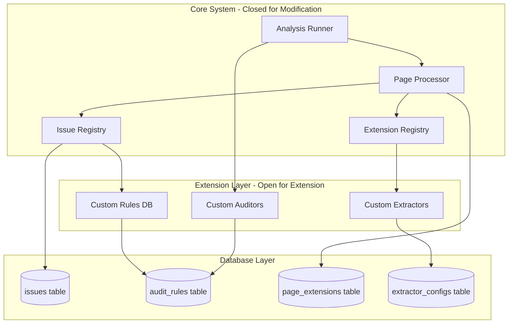
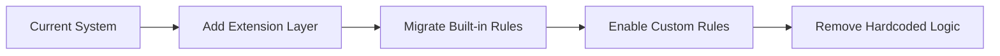

# Extensible Architecture Plan for SEO Analysis System

## Overview

This document outlines a comprehensive plan to make the SEO analysis system open for extension but closed for modification. The architecture enables:

- **Custom Issues**: Database-driven issue rules that can be added without code changes
- **Extensible Page Data**: New data types (keywords, href tags, etc.) can be added dynamically
- **Dynamic SEO Audits**: New audit checks can be defined and applied at runtime

## Current Architecture Analysis

### Current Issues with Extensibility

1. **Hardcoded Issue Types** ([`issue.rs`](src-tauri/src/contexts/analysis/domain/issue.rs))
   - Issues are created programmatically in [`Page::audit()`](src-tauri/src/contexts/analysis/domain/page.rs:37)
   - Adding new issue types requires code changes

2. **Fixed Page Data Schema** ([`page.rs`](src-tauri/src/contexts/analysis/domain/page.rs))
   - Page struct has fixed fields
   - Adding new data requires schema migrations and code changes

3. **Hardcoded SEO Checks** ([`light.rs`](src-tauri/src/service/auditor/light.rs))
   - `SeoAuditDetails` has fixed check types
   - Adding new checks requires modifying the auditor

---

## Proposed Architecture

### Core Design Principles

1. **Plugin-Based Architecture**: All extensions are plugins that implement well-defined traits
2. **Database-Driven Configuration**: Rules and checks are stored in database tables
3. **Registry Pattern**: Central registry for discovering and managing extensions
4. **Strategy Pattern**: Different evaluation strategies for different rule types
5. **Auto-Discovery**: System loads extensions from database at startup

### High-Level Architecture



---

## Component Design

### 1. Extension Registry

The central component that manages all extensions:

```rust
// src/extension/mod.rs
pub struct ExtensionRegistry {
    issue_rules: Vec<Box<dyn IssueRule>>,
    data_extractors: Vec<Box<dyn PageDataExtractor>>,
    audit_checks: Vec<Box<dyn AuditCheck>>,
}

impl ExtensionRegistry {
    pub async fn load_from_database(pool: &SqlitePool) -> Result<Self>;
    pub fn register_issue_rule(&mut self, rule: Box<dyn IssueRule>);
    pub fn register_extractor(&mut self, extractor: Box<dyn PageDataExtractor>);
    pub fn register_audit_check(&mut self, check: Box<dyn AuditCheck>);
}
```

### 2. Issue Rule System

#### Database Schema

```sql
-- Audit rules table
CREATE TABLE audit_rules (
    id INTEGER PRIMARY KEY AUTOINCREMENT,
    name TEXT NOT NULL UNIQUE,
    category TEXT NOT NULL,           -- seo, performance, accessibility
    severity TEXT NOT NULL,           -- critical, warning, info
    description TEXT NOT NULL,

    -- Rule definition
    rule_type TEXT NOT NULL,          -- threshold, presence, regex, custom
    target_field TEXT NOT NULL,       -- page field to check
    condition TEXT NOT NULL,          -- JSON condition definition
    threshold_value TEXT,             -- For threshold rules
    regex_pattern TEXT,               -- For regex rules

    -- Metadata
    recommendation TEXT,              -- How to fix
    learn_more_url TEXT,              -- Link to documentation

    -- Control
    is_enabled INTEGER NOT NULL DEFAULT 1,
    is_builtin INTEGER NOT NULL DEFAULT 0,
    created_at TEXT NOT NULL DEFAULT datetime,
    updated_at TEXT NOT NULL DEFAULT datetime
);

-- Rule conditions stored as JSON
-- Example conditions:
-- {"type": "empty", "negate": false}           -- Field must not be empty
-- {"type": "length", "min": 30, "max": 60}     -- Length constraints
-- {"type": "range", "min": 0, "max": 400}      -- Numeric range
-- {"type": "regex", "pattern": "^https://"}    -- Regex match
-- {"type": "equals", "value": 200}             -- Exact match
```

#### Trait Definition

```rust
// src/extension/issue_rule.rs
use async_trait::async_trait;
use crate::contexts::{NewIssue, Page, IssueSeverity};

#[async_trait]
pub trait IssueRule: Send + Sync {
    /// Unique identifier for this rule
    fn id(&self) -> &str;

    /// Human-readable name
    fn name(&self) -> &str;

    /// Category for grouping
    fn category(&self) -> &str;

    /// Evaluate the rule against a page
    async fn evaluate(&self, page: &Page, context: &EvaluationContext) -> Option<NewIssue>;

    /// Whether this rule applies to the given page
    fn applies_to(&self, page: &Page) -> bool {
        true
    }
}

pub struct EvaluationContext {
    pub html: Option<String>,
    pub headers: HashMap<String, String>,
    pub lighthouse_data: Option<LighthouseData>,
}

// Built-in rule implementations
pub struct ThresholdRule {
    id: String,
    name: String,
    field: String,
    min: Option<f64>,
    max: Option<f64>,
    severity: IssueSeverity,
    message_template: String,
}

pub struct PresenceRule {
    id: String,
    name: String,
    field: String,
    must_exist: bool,
    severity: IssueSeverity,
    message: String,
}

pub struct RegexRule {
    id: String,
    name: String,
    field: String,
    pattern: Regex,
    should_match: bool,
    severity: IssueSeverity,
    message: String,
}
```

### 3. Page Data Extension System

#### Database Schema

```sql
-- Extractor configurations
CREATE TABLE extractor_configs (
    id INTEGER PRIMARY KEY AUTOINCREMENT,
    name TEXT NOT NULL UNIQUE,
    display_name TEXT NOT NULL,
    description TEXT,

    -- Extraction definition
    extractor_type TEXT NOT NULL,     -- css_selector, xpath, regex, json_path
    selector TEXT NOT NULL,           -- CSS selector, XPath, or regex pattern
    attribute TEXT,                   -- Attribute to extract (null for text content)

    -- Processing
    post_process TEXT,                -- JSON array of post-processing steps

    -- Storage
    storage_type TEXT NOT NULL,       -- column, json, separate_table
    target_column TEXT,               -- Column name if storage_type is column
    target_table TEXT,                -- Table name if separate_table

    -- Control
    is_enabled INTEGER NOT NULL DEFAULT 1,
    is_builtin INTEGER NOT NULL DEFAULT 0,
    created_at TEXT NOT NULL DEFAULT datetime
);

-- Extended page data (flexible storage)
CREATE TABLE page_extensions (
    id INTEGER PRIMARY KEY AUTOINCREMENT,
    page_id TEXT NOT NULL REFERENCES pages(id) ON DELETE CASCADE,
    extractor_id INTEGER NOT NULL REFERENCES extractor_configs(id) ON DELETE CASCADE,

    -- Flexible data storage
    value_text TEXT,
    value_number REAL,
    value_json TEXT,                  -- JSON for complex data

    UNIQUE(page_id, extractor_id)
);

-- Keywords extracted from pages
CREATE TABLE page_keywords (
    id INTEGER PRIMARY KEY AUTOINCREMENT,
    page_id TEXT NOT NULL REFERENCES pages(id) ON DELETE CASCADE,
    keyword TEXT NOT NULL,
    frequency INTEGER NOT NULL DEFAULT 1,
    density REAL,                     -- Percentage of total words
    is_meta_keyword INTEGER NOT NULL DEFAULT 0,
    UNIQUE(page_id, keyword)
);

-- Href tags extracted from head
CREATE TABLE page_href_tags (
    id INTEGER PRIMARY KEY AUTOINCREMENT,
    page_id TEXT NOT NULL REFERENCES pages(id) ON DELETE CASCADE,
    rel TEXT NOT NULL,                -- stylesheet, icon, canonical, etc.
    href TEXT NOT NULL,
    type TEXT,                        -- MIME type if applicable
    sizes TEXT,                       -- For icons
    media TEXT,                       -- Media query
    UNIQUE(page_id, rel, href)
);
```

#### Trait Definition

```rust
// src/extension/data_extractor.rs
use async_trait::async_trait;
use scraper::Html;

#[async_trait]
pub trait PageDataExtractor: Send + Sync {
    /// Unique identifier
    fn id(&self) -> &str;

    /// Human-readable name
    fn name(&self) -> &str;

    /// Extract data from HTML
    async fn extract(&self, html: &Html, url: &str) -> Result<ExtractedData>;

    /// Database column type for storage
    fn column_type(&self) -> &str;

    /// Whether this extractor requires additional processing
    fn requires_processing(&self) -> bool {
        false
    }
}

pub enum ExtractedData {
    Text(String),
    Number(f64),
    Boolean(bool),
    Json(serde_json::Value),
    List(Vec<String>),
    KeyValue(HashMap<String, String>),
}

// Built-in extractors
pub struct KeywordExtractor;
pub struct HrefTagExtractor;
pub struct OpenGraphExtractor;
pub struct TwitterCardExtractor;
pub struct StructuredDataExtractor;
```

### 4. Audit Check Extension System

#### Database Schema

```sql
-- Audit check definitions
CREATE TABLE audit_checks (
    id INTEGER PRIMARY KEY AUTOINCREMENT,
    key TEXT NOT NULL UNIQUE,         -- Machine-readable key
    label TEXT NOT NULL,              -- Human-readable label
    category TEXT NOT NULL,           -- seo, performance, accessibility

    -- Check definition
    check_type TEXT NOT NULL,         -- selector_count, field_check, custom
    selector TEXT,                    -- CSS selector for selector_count
    field TEXT,                       -- Page field for field_check
    condition TEXT NOT NULL,          -- JSON condition

    -- Scoring
    weight REAL NOT NULL DEFAULT 1.0, -- Weight in overall score
    pass_score REAL NOT NULL DEFAULT 1.0,
    fail_score REAL NOT NULL DEFAULT 0.0,

    -- Messages
    pass_message TEXT,
    fail_message TEXT,

    -- Control
    is_enabled INTEGER NOT NULL DEFAULT 1,
    is_builtin INTEGER NOT NULL DEFAULT 0,
    created_at TEXT NOT NULL DEFAULT datetime
);
```

#### Trait Definition

```rust
// src/extension/audit_check.rs
use async_trait::async_trait;

#[async_trait]
pub trait AuditCheck: Send + Sync {
    /// Unique key for this check
    fn key(&self) -> &str;

    /// Human-readable label
    fn label(&self) -> &str;

    /// Category for grouping
    fn category(&self) -> &str;

    /// Weight in overall score calculation
    fn weight(&self) -> f64;

    /// Perform the check
    async fn check(&self, context: &AuditContext) -> CheckResult;
}

pub struct AuditContext {
    pub page: Page,
    pub html: Html,
    pub url: Url,
    pub response_headers: HashMap<String, String>,
}

pub struct CheckResult {
    pub passed: bool,
    pub score: f64,
    pub value: Option<String>,
    pub description: Option<String>,
}
```

---

## Implementation Plan

### Phase 1: Core Extension Infrastructure

1. **Create Extension Module Structure**
   - [ ] Create `src/extension/mod.rs` with `ExtensionRegistry`
   - [ ] Create `src/extension/issue_rule.rs` with traits and built-in rules
   - [ ] Create `src/extension/data_extractor.rs` with traits
   - [ ] Create `src/extension/audit_check.rs` with traits

2. **Database Migrations**
   - [ ] Create migration for `audit_rules` table
   - [ ] Create migration for `extractor_configs` table
   - [ ] Create migration for `page_extensions` table
   - [ ] Create migration for `page_keywords` table
   - [ ] Create migration for `page_href_tags` table
   - [ ] Create migration for `audit_checks` table

3. **Seed Built-in Rules**
   - [ ] Create seed data for built-in issue rules
   - [ ] Create seed data for built-in extractors
   - [ ] Create seed data for built-in audit checks

### Phase 2: Issue Rule System

1. **Implement Rule Traits**
   - [ ] Implement `IssueRule` trait
   - [ ] Implement `ThresholdRule` for numeric comparisons
   - [ ] Implement `PresenceRule` for existence checks
   - [ ] Implement `RegexRule` for pattern matching
   - [ ] Implement `CompositeRule` for combining rules

2. **Rule Loader**
   - [ ] Create `RuleLoader` to load rules from database
   - [ ] Implement rule caching for performance
   - [ ] Add rule validation on load

3. **Integrate with Page Audit**
   - [ ] Modify `Page::audit()` to use extension registry
   - [ ] Remove hardcoded issue generation
   - [ ] Add context building for rule evaluation

### Phase 3: Page Data Extension System

1. **Implement Extractor Traits**
   - [ ] Implement `PageDataExtractor` trait
   - [ ] Create `CssSelectorExtractor`
   - [ ] Create `RegexExtractor`
   - [ ] Create `KeywordExtractor`
   - [ ] Create `HrefTagExtractor`

2. **Storage Layer**
   - [ ] Create `PageExtensionRepository`
   - [ ] Implement dynamic column handling
   - [ ] Add JSON storage for complex data

3. **Integrate with Page Processing**
   - [ ] Modify page processor to run extractors
   - [ ] Add extension data to `PageDetails`
   - [ ] Update API responses to include extensions

### Phase 4: Audit Check Extension System

1. **Implement Audit Check Traits**
   - [ ] Implement `AuditCheck` trait
   - [ ] Create `SelectorCountCheck`
   - [ ] Create `FieldCheck`
   - [ ] Create `CustomCheck` with scripting support

2. **Dynamic Scoring**
   - [ ] Modify `SeoAuditDetails` to be dynamic
   - [ ] Implement weighted score calculation
   - [ ] Add check result aggregation

3. **Integrate with Auditor**
   - [ ] Modify `LightAuditor` to use extension registry
   - [ ] Remove hardcoded check methods
   - [ ] Add dynamic check loading

### Phase 5: API and Frontend

1. **Extension Management API**
   - [ ] Create CRUD endpoints for audit rules
   - [ ] Create CRUD endpoints for extractors
   - [ ] Create CRUD endpoints for audit checks

2. **Frontend Integration**
   - [ ] Update TypeScript types with Specta
   - [ ] Create extension management UI
   - [ ] Update analysis views to show extensions

---

## Migration Strategy

### Backward Compatibility

1. **Existing Issues**: All existing hardcoded issues become built-in rules
2. **Existing Page Data**: All existing fields remain, extensions add new data
3. **Existing Audits**: All existing checks become built-in audit checks

### Migration Steps



1. Add extension infrastructure without removing existing code
2. Create built-in rules that replicate current behavior
3. Test that built-in rules produce identical results
4. Switch to extension-based system
5. Remove hardcoded implementations

---

## Example: Adding a Custom Issue Rule

### Via Database

```sql
INSERT INTO audit_rules (
    name, category, severity, description,
    rule_type, target_field, condition,
    recommendation, is_enabled
) VALUES (
    'Missing Open Graph Title',
    'seo',
    'warning',
    'Page does not have an og:title meta tag',
    'presence',
    'og_title',
    '{"type": "empty", "negate": true}',
    'Add an og:title meta tag for better social sharing',
    1
);
```

### Via API

```typescript
// Frontend code to add custom rule
await api.createAuditRule({
  name: "Keyword in Title",
  category: "seo",
  severity: "warning",
  description: "Target keyword should appear in page title",
  ruleType: "regex",
  targetField: "title",
  condition: JSON.stringify({
    type: "regex",
    pattern: "{keyword}",
    flags: "i",
  }),
  recommendation: "Include your target keyword in the page title",
});
```

---

## Performance Considerations

1. **Rule Caching**: Load rules once at startup, refresh on demand
2. **Batch Processing**: Evaluate all rules in a single pass
3. **Lazy Extraction**: Only run extractors when data is needed
4. **Index Strategy**: Add indexes on frequently queried extension fields

---

## Security Considerations

1. **Input Validation**: Validate all rule conditions before execution
2. **Sandboxing**: Consider sandboxing custom script rules
3. **Rate Limiting**: Limit number of custom rules per tenant
4. **Audit Trail**: Log all rule changes for compliance

---

## File Structure

```
src-tauri/src/
├── extension/
│   ├── mod.rs                    # ExtensionRegistry
│   ├── issue_rule.rs             # IssueRule trait and implementations
│   ├── data_extractor.rs         # PageDataExtractor trait and implementations
│   ├── audit_check.rs            # AuditCheck trait and implementations
│   ├── loader.rs                 # Database loader for extensions
│   └── builtins/
│       ├── mod.rs
│       ├── seo_rules.rs          # Built-in SEO issue rules
│       ├── performance_rules.rs  # Built-in performance rules
│       └── extractors.rs         # Built-in data extractors
├── repository/
│   └── sqlite/
│       ├── extension_repository.rs  # Extension CRUD operations
│       └── page_extension_repository.rs  # Page extension data
└── contexts/
    └── analysis/
        └── domain/
            └── page.rs           # Modified to use extensions
```

---

## Next Steps

1. Review this plan and provide feedback
2. Prioritize phases based on product needs
3. Begin implementation with Phase 1
