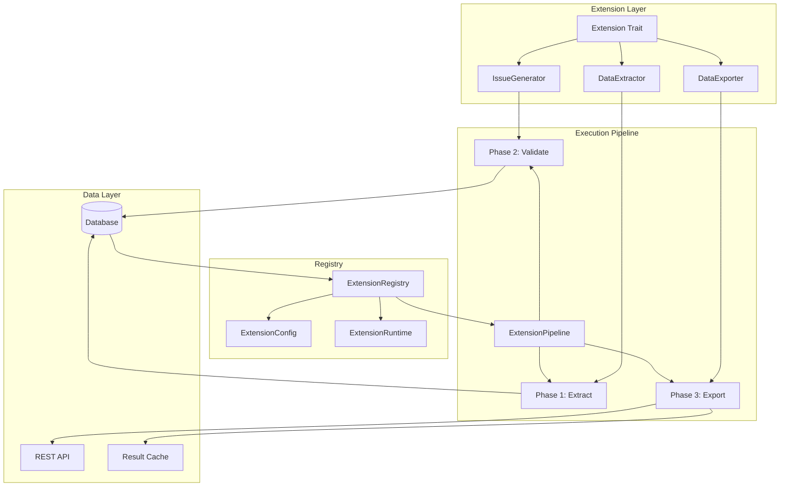

# Extension Rule System Refactoring Plan

## Executive Summary

This plan outlines the refactoring of the extension architecture to enforce its intended role as a strict rule-based system for user-defined rules. The new architecture will provide clear interfaces and an execution pipeline enabling extensions to perform three specific functions:

1. **Issue Generation** - Generate issues based on custom validation logic
2. **Data Extraction** - Extract structured data from HTML content
3. **Data Exposure** - Expose extracted data for external consumption via API

## Current Architecture Analysis

### Existing Components

| Component                                                                           | Location                   | Purpose                                        |
| ----------------------------------------------------------------------------------- | -------------------------- | ---------------------------------------------- |
| [`IssueRule`](src-tauri/src/contexts/extension/domain/issue_rule.rs:177)            | `domain/issue_rule.rs`     | Trait for generating issues from page analysis |
| [`PageDataExtractor`](src-tauri/src/contexts/extension/domain/data_extractor.rs:84) | `domain/data_extractor.rs` | Trait for extracting data from HTML            |
| [`AuditCheck`](src-tauri/src/contexts/extension/domain/audit_check.rs:120)          | `domain/audit_check.rs`    | Trait for SEO audit scoring                    |
| [`ExtensionRegistry`](src-tauri/src/extension/mod.rs:38)                            | `extension/mod.rs`         | Central registry for all extensions            |
| [`ExtensionLoader`](src-tauri/src/extension/loader.rs:25)                           | `extension/loader.rs`      | Loads extensions from database                 |

### Current Issues

1. **Fragmented Interfaces** - Three separate traits with no unified contract
2. **No Data Exposure** - Extracted data is not exposed for external consumption
3. **No Execution Pipeline** - Rules are evaluated without orchestration
4. **Overlapping Concerns** - Audit checks and issue rules have similar functionality
5. **Limited User Customization** - No clear versioning or configuration for user rules

## Proposed Architecture

### Core Design Principles

1. **Single Extension Trait** - Unified interface for all extension types
2. **Capability-Based Design** - Extensions declare what they can do
3. **Pipeline Execution** - Orchestrated execution with clear phases
4. **Data Exposure Layer** - Built-in support for external data access
5. **User-First Design** - All extensions are user-configurable by default

### Architecture Diagram



## New Interface Design

### 1. Core Extension Trait

```rust
/// Capabilities an extension can have
#[derive(Debug, Clone, Copy, PartialEq, Eq)]
pub enum ExtensionCapability {
    IssueGeneration,
    DataExtraction,
    DataExport,
}

/// Core extension trait that all extensions must implement
pub trait Extension: Send + Sync {
    // Metadata
    fn id(&self) -> &str;
    fn name(&self) -> &str;
    fn description(&self) -> Option<&str>;
    fn version(&self) -> &str;

    // Capabilities
    fn capabilities(&self) -> Vec<ExtensionCapability>;

    // Lifecycle
    fn initialize(&mut self, config: &ExtensionConfig) -> Result<()>;
    fn shutdown(&mut self) -> Result<()>;
}
```

### 2. Issue Generator Interface

```rust
/// Context for issue generation
pub struct ValidationContext {
    pub page: Page,
    pub html: Option<String>,
    pub headers: HashMap<String, String>,
    pub extracted_data: HashMap<String, serde_json::Value>,
    pub lighthouse_data: Option<LighthouseData>,
}

/// Result of issue generation
pub struct ValidationResult {
    pub issues: Vec<NewIssue>,
    pub score_impact: f64,
    pub metadata: HashMap<String, serde_json::Value>,
}

/// Trait for extensions that generate issues
pub trait IssueGenerator: Extension {
    fn validate(&self, context: &ValidationContext) -> Result<ValidationResult>;
    fn applies_to(&self, page: &Page) -> bool;
    fn severity(&self) -> IssueSeverity;
    fn recommendation(&self) -> Option<&str>;
}
```

### 3. Data Extractor Interface

```rust
/// Context for data extraction
pub struct ExtractionContext {
    pub html: String,
    pub url: String,
    pub page_id: String,
}

/// Extracted data with metadata
pub struct ExtractionResult {
    pub data: HashMap<String, ExtractedData>,
    pub metadata: ExtractionMetadata,
}

/// Trait for extensions that extract data
pub trait DataExtractor: Extension {
    fn extract(&self, context: &ExtractionContext) -> Result<ExtractionResult>;
    fn schema(&self) -> ExtractionSchema;
    fn column_type(&self) -> &str;
}
```

### 4. Data Exporter Interface

```rust
/// Export format options
pub enum ExportFormat {
    Json,
    Csv,
    Xml,
    Custom(String),
}

/// Export target configuration
pub struct ExportTarget {
    pub format: ExportFormat,
    pub endpoint: Option<String>,
    pub headers: HashMap<String, String>,
}

/// Trait for extensions that expose data
pub trait DataExporter: Extension {
    fn export(&self, data: &HashMap<String, ExtractedData>) -> Result<serde_json::Value>;
    fn export_format(&self) -> ExportFormat;
    fn export_endpoint(&self) -> Option<&str>;
}
```

### 5. Extension Pipeline

```rust
/// Pipeline for orchestrated extension execution
pub struct ExtensionPipeline {
    extractors: Vec<Arc<dyn DataExtractor>>,
    validators: Vec<Arc<dyn IssueGenerator>>,
    exporters: Vec<Arc<dyn DataExporter>>,
}

impl ExtensionPipeline {
    /// Phase 1: Extract data from HTML
    pub async fn extract_phase(&self, context: &ExtractionContext) -> HashMap<String, ExtractedData>;

    /// Phase 2: Validate and generate issues
    pub async fn validate_phase(&self, context: &ValidationContext) -> Vec<NewIssue>;

    /// Phase 3: Export data for external consumption
    pub async fn export_phase(&self, data: &HashMap<String, ExtractedData>) -> Vec<ExportResult>;

    /// Run full pipeline
    pub async fn execute(&self, page: &Page, html: &str) -> PipelineResult;
}
```

## Implementation Plan

### Phase 1: Core Interfaces

1. Create new trait definitions in `extension/traits.rs`
2. Define capability enums and metadata structs
3. Create context structs for each phase
4. Define result types with proper error handling

### Phase 2: Extension Registry Refactor

1. Refactor [`ExtensionRegistry`](src-tauri/src/extension/mod.rs:38) to use capability-based registration
2. Add extension configuration management
3. Implement extension lifecycle management
4. Add caching layer for results

### Phase 3: Pipeline Implementation

1. Create `ExtensionPipeline` with three-phase execution
2. Implement parallel extraction for performance
3. Add validation aggregation logic
4. Implement export queue for external endpoints

### Phase 4: Migration

1. Create adapter implementations for existing rules
2. Migrate built-in rules to new interface
3. Update database schema for new configuration model
4. Create migration scripts for existing data

### Phase 5: API Layer

1. Create REST endpoints for data exposure
2. Add WebSocket support for real-time updates
3. Implement authentication for external access
4. Add rate limiting and caching

## File Structure

```
src-tauri/src/extension/
├── mod.rs              # Public API and registry
├── traits.rs           # Core trait definitions
├── capabilities.rs     # Capability definitions
├── context.rs          # Context structs
├── result.rs           # Result types
├── pipeline.rs         # Execution pipeline
├── config.rs           # Extension configuration
├── loader.rs           # Database loading (refactored)
├── cache.rs            # Result caching
└── builtins/           # Built-in extensions
    ├── mod.rs
    ├── rules/          # Issue generators
    │   ├── presence.rs
    │   ├── length.rs
    │   ├── threshold.rs
    │   └── regex.rs
    ├── extractors/     # Data extractors
    │   ├── opengraph.rs
    │   ├── twitter.rs
    │   └── structured_data.rs
    └── exporters/      # Data exporters
        ├── json.rs
        └── webhook.rs
```

## Database Schema Changes

### New Tables

```sql
-- Extension configurations
CREATE TABLE extension_configs (
    id TEXT PRIMARY KEY,
    name TEXT NOT NULL,
    description TEXT,
    version TEXT NOT NULL,
    capabilities TEXT NOT NULL, -- JSON array
    config TEXT, -- JSON configuration
    is_enabled BOOLEAN DEFAULT true,
    is_builtin BOOLEAN DEFAULT false,
    created_at TIMESTAMP DEFAULT CURRENT_TIMESTAMP,
    updated_at TIMESTAMP DEFAULT CURRENT_TIMESTAMP
);

-- Extension execution results
CREATE TABLE extension_results (
    id TEXT PRIMARY KEY,
    extension_id TEXT NOT NULL,
    page_id TEXT NOT NULL,
    result_type TEXT NOT NULL,
    result_data TEXT NOT NULL, -- JSON
    executed_at TIMESTAMP DEFAULT CURRENT_TIMESTAMP,
    FOREIGN KEY (extension_id) REFERENCES extension_configs(id),
    FOREIGN KEY (page_id) REFERENCES pages(id)
);

-- Export queue
CREATE TABLE export_queue (
    id TEXT PRIMARY KEY,
    extension_id TEXT NOT NULL,
    target_endpoint TEXT,
    format TEXT NOT NULL,
    data TEXT NOT NULL, -- JSON
    status TEXT DEFAULT 'pending',
    attempts INTEGER DEFAULT 0,
    created_at TIMESTAMP DEFAULT CURRENT_TIMESTAMP,
    sent_at TIMESTAMP,
    error_message TEXT
);
```

## API Endpoints

### New Endpoints

| Method | Path                          | Description                |
| ------ | ----------------------------- | -------------------------- |
| GET    | `/api/extensions`             | List all extensions        |
| GET    | `/api/extensions/{id}`        | Get extension details      |
| POST   | `/api/extensions`             | Create custom extension    |
| PUT    | `/api/extensions/{id}`        | Update extension           |
| DELETE | `/api/extensions/{id}`        | Delete extension           |
| GET    | `/api/extensions/{id}/data`   | Get extracted data         |
| POST   | `/api/extensions/{id}/export` | Trigger data export        |
| GET    | `/api/data/extracted`         | Query all extracted data   |
| WS     | `/ws/extensions`              | Real-time extension events |

## Migration Strategy

### Step 1: Parallel Implementation

- Implement new interfaces alongside existing code
- Create adapters that wrap old traits
- No breaking changes to existing functionality

### Step 2: Gradual Migration

- Migrate built-in extensions one by one
- Update tests for each migrated extension
- Verify functionality at each step

### Step 3: Deprecation

- Mark old traits as deprecated
- Update documentation
- Provide migration guide for custom extensions

### Step 4: Removal

- Remove old trait definitions
- Clean up adapter code
- Update all references

## Testing Strategy

### Unit Tests

- Test each trait implementation independently
- Test pipeline phases in isolation
- Test configuration parsing

### Integration Tests

- Test full pipeline execution
- Test database persistence
- Test API endpoints

### Performance Tests

- Benchmark extraction performance
- Test parallel execution
- Measure memory usage

## Risks and Mitigations

| Risk                            | Impact | Mitigation                                     |
| ------------------------------- | ------ | ---------------------------------------------- |
| Breaking existing functionality | High   | Parallel implementation with adapters          |
| Performance regression          | Medium | Benchmark before/after, optimize pipeline      |
| Data migration issues           | High   | Comprehensive migration scripts, rollback plan |
| API breaking changes            | Medium | Version API, provide compatibility layer       |

## Success Criteria

1. All existing functionality preserved
2. Clear separation of concerns between capabilities
3. User-defined extensions work without code changes
4. Data exposure API functional and documented
5. Performance within 10% of current baseline
6. Test coverage above 80%

## Timeline

The implementation should proceed in phases, with each phase being fully tested before moving to the next. The phases are ordered by dependency:

1. **Core Interfaces** - Foundation for everything else
2. **Registry Refactor** - Enables new extension model
3. **Pipeline Implementation** - Orchestrates execution
4. **Migration** - Moves existing code to new model
5. **API Layer** - Exposes data externally

Each phase should be reviewed and approved before proceeding to the next.
