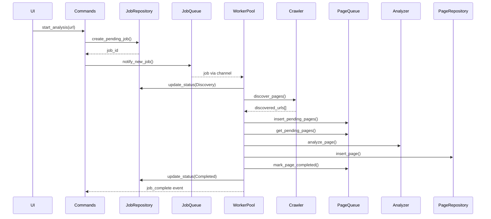

# Job Processor Modernization Plan

## Executive Summary

Replace the current polling-based job processor with an event-driven, concurrent worker pool architecture that eliminates the busy loop and enables parallel processing of multiple jobs.

## Current Architecture Analysis

### Existing Implementation

```
┌─────────────────────────────────────────────────────────────┐
│                      JobProcessor::run()                    │
│  ┌──────────────────────────────────────────────────────┐  │
│  │ loop {                                              │  │
│  │   job = job_queue.fetch_next_job().await  ← POLL   │  │
│  │   if job {                                          │  │
│  │     process_job(job).await  ← SEQUENTIAL            │  │
│  │   }                                                 │  │
│  │ }                                                   │  │
│  └──────────────────────────────────────────────────────┘  │
└─────────────────────────────────────────────────────────────┘
```

### Issues Identified

1. **Polling-based (busy loop)**: Polls database every 15 seconds even when idle
2. **Single-threaded processing**: Only one job processed at a time
3. **No event notification**: No mechanism to wake workers when new jobs arrive
4. **Sequential analysis**: Pages analyzed one at a time within a job

## Proposed Architecture

### High-Level Design

```
┌─────────────────────────────────────────────────────────────────┐
│                    Event-Driven Job Processor                   │
│  ┌───────────────┐     ┌───────────────┐     ┌───────────────┐ │
│  │ Job Channel   │────▶│  Worker 1     │────▶│ Process Job   │ │
│  │ (tokio::mpsc)│     │ (concurrent)   │     │ (discovery +  │ │
│  └───────────────┘     └───────────────┘     │  analysis)    │ │
│         ▲                     │             └───────────────┘ │
│         │                     ▼                               │
│         │              ┌───────────────┐                       │
│         │              │  Worker 2     │────▶Process Job       │
│         │              │ (concurrent)  │                       │
│         │              └───────────────┘                       │
│         │                     │                                │
│         │                     ▼                                │
│         │              ┌───────────────┐                       │
│         │              │  Worker N     │────▶Process Job       │
│         │              │ (concurrent)  │                       │
│         │              └───────────────┘                       │
│         │                                                     │
│         │    ┌─────────────────────────────────────────┐      │
│         └────│ Notification on Job Creation (command)   │      │
│              └─────────────────────────────────────────┘      │
└─────────────────────────────────────────────────────────────────┘
```

### Component Changes

#### 1. JobQueue (queue.rs)

**Current:**

```rust
// Polling-based fetch
pub async fn fetch_next_job(&self) -> Option<Job> {
    loop {
        match self.repo.get_pending().await { ... }
    }
}
```

**Proposed:**

```rust
// Channel-based receive
pub async fn receive_job(&self) -> Option<Job> {
    self.rx.recv().await.ok()
}
```

#### 2. JobProcessor (mod.rs)

**Current:**

```rust
pub async fn run(&self) -> Result<()> {
    loop {
        if let Some(job) = self.job_queue.fetch_next_job().await {
            self.process_job(job).await;
        }
    }
}
```

**Proposed:**

```rust
pub async fn run(&self) -> Result<()> {
    // Spawn worker tasks
    let workers: Vec<_> = (0..self.config.max_workers)
        .map(|id| self.spawn_worker(id))
        .collect();

    // Wait for all workers
    futures::future::join_all(workers).await;
    Ok(())
}

async fn spawn_worker(&self, id: usize) {
    loop {
        match self.job_queue.receive_job().await {
            Some(job) => self.process_job(job).await,
            None => break, // Channel closed
        }
    }
}
```

#### 3. Job Creation (commands/analysis.rs)

**Current:**

```rust
// Insert to DB only
let job_id = repository.create(url, settings).await;
```

**Proposed:**

```rust
// Insert to DB + notify
let job_id = repository.create(url, settings).await;
job_queue.notify_new_job().await; // Wake up sleeping workers
```

### Data Flow Diagram



## Page Queue Architecture

### New Table: page_queue

To track pages to analyze separately from analyzed pages, enabling:

- Resumability after crash
- Concurrent page analysis
- Individual page status tracking

```sql
CREATE TABLE page_queue (
    id TEXT PRIMARY KEY,
    job_id TEXT NOT NULL,
    url TEXT NOT NULL,
    depth INTEGER NOT NULL DEFAULT 0,
    status TEXT NOT NULL DEFAULT 'pending',
    -- status: pending, processing, completed, failed
    retry_count INTEGER NOT NULL DEFAULT 0,
    error_message TEXT,
    created_at TEXT NOT NULL,
    updated_at TEXT NOT NULL,
    FOREIGN KEY (job_id) REFERENCES jobs(id)
);

CREATE INDEX idx_page_queue_job_status ON page_queue(job_id, status);
```

### Benefits

1. **Resumability** - If app crashes, pages in "pending" or "processing" can be retried
2. **Concurrent analysis** - Multiple workers can claim different pages from queue
3. **Error handling** - Failed pages can be retried with backoff
4. **Progress** - Exact count of pending vs completed per job

### Page Processing Flow

```
Discovery Phase:
  1. Crawler discovers URLs
  2. Insert all URLs into page_queue with status='pending'
  3. Mark job status as 'Processing'

Analysis Phase:
  1. Worker claims a pending page (SELECT FOR UPDATE or atomic update)
  2. Mark page as 'processing'
  3. Analyze page
  4. Insert results to pages table
  5. Mark page as 'completed'
  6. Repeat until no pending pages

Completion:
  1. When no pending/processing pages remain
  2. Mark job as 'completed'
```

### Concurrency Strategy

#### Worker Pool Configuration

- **Default workers**: Number of CPU cores (capped at 8)
- **Configurable**: Via settings or environment variable
- **Per-worker resources**: Shared analyzer/crawler via Arc

#### Rate Limiting

- Global semaphore for concurrent HTTP requests
- Per-domain rate limiting via `dashmap::DashMap`
- Configurable delay between requests per job

#### Progress Reporting

- Each worker emits progress independently
- Progress events include job_id for disambiguation
- Frontend filters by job_id

## Implementation Steps

### Phase 1: Core Infrastructure

1. Create new migration for page_queue table
2. Add PageQueueRepository trait
3. Create `JobChannel` wrapper for tokio mpsc
4. Add `notify()` method to JobQueue
5. Update JobProcessor to spawn worker pool

### Phase 2: Page Queue Integration

1. Add page queue repository implementation
2. Modify discovery phase to insert into page_queue
3. Modify analysis phase to pull from page_queue
4. Add page status update methods

### Phase 3: Integration

1. Add job notification to command handlers
2. Update progress reporter for concurrent jobs
3. Add per-job cancellation support

### Phase 4: Optimization (Optional)

1. Concurrent page discovery with futures
2. Concurrent analysis with semaphore
3. Connection pooling per domain

## Files to Modify

| File                                    | Changes                         |
| --------------------------------------- | ------------------------------- |
| `migrations/0027_create_page_queue.sql` | New migration                   |
| `domain/page.rs`                        | Add PageQueueItem struct        |
| `repository/mod.rs`                     | Add PageQueueRepository trait   |
| `repository/sqlite/page_queue.rs`       | New implementation              |
| `service/processor/queue.rs`            | Add channel-based job receiving |
| `service/processor/mod.rs`              | Convert to worker pool pattern  |
| `service/processor/page_queue.rs`       | New page queue management       |
| `lifecycle/app_state.rs`                | Pass channel to components      |
| `commands/analysis.rs`                  | Notify on job creation          |

## Testing Considerations

1. Multiple jobs processed concurrently
2. Multiple pages analyzed concurrently within a job
3. Job cancellation mid-processing
4. Page queue recovery after crash
5. Graceful shutdown with running jobs
6. Progress reporting accuracy
